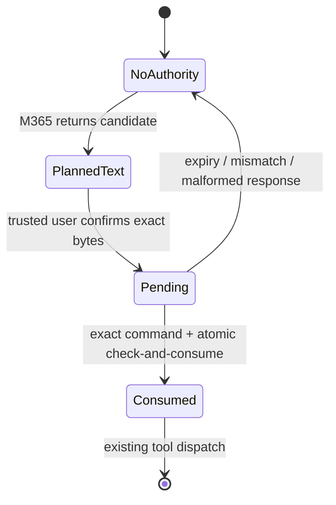

# Capability-bound execution authorization

**Date:** 2026-08-09  
**Status:** research proposal; no runtime change  
**Decision context:** the accepted 8H verifier remains the default production
path. It is fail-closed: only `EXECUTE` permits a tool call.

## Summary

Do not replace Bonsai with another local model that answers `EXECUTE`, `TEXT`,
or `UNCERTAIN`. The failed bake-off shows that this is the wrong trust boundary:
an untrusted model's interpretation of its own prose decides whether its prose
becomes an effect.

Add an optional, low-latency **capability-bound authorization path** instead.
It changes the question from:

> Does this generated text sound like an instruction to execute?

to:

> Did the trusted user authorize this exact, still-valid, single-use action?

The proxy creates an opaque, server-side authorization record only after an
explicit confirmation UI or trusted client request. The record binds the exact
command bytes and all execution-relevant context. The M365 response remains
untrusted. It can supply a command, but it cannot create, broaden, reuse, or
modify the authorization. A deterministic comparison at the tool boundary
allows the action only when the recovered command is exactly the authorized
one. Everything else retains the current 8H path and its fail-closed behavior.

This is a different architecture, not a direct-answer model candidate. It moves
authority from model-generated language to a user-confirmed object capability.

## Why this direction

The current verifier spends a 27B local-reasoner inference (24.7 s median in
project evidence) on a three-way judgment. The direct-answer bake-off made the
tradeoff unacceptable: five candidates changed `TEXT` to `EXECUTE`; the only
safe one had low selective accuracy and execute recall. More calibration or a
smaller answer model preserves the same unsafe proposition: a probabilistic
reader of generated prose authorizes generated prose.

Capability systems instead make possession of a narrow, unforgeable authority
the condition for an operation. NETCAP describes a capability as a lightweight,
unforgeable token that grants its holder access to authorized resources [1].
The relevant principle here is narrow authority, not the paper's network data
plane.

The transaction-authorization guidance is especially applicable: the user must
see and acknowledge significant transaction data; authorization must be
server-side; each authorization should be unique, time-limited, and checked at
the final execution gate [2]. OWASP also recommends default deny and permission
validation on every request [3]. These are direct matches for a proxy that turns
text into shell effects.

## Proposed protocol

### 1. Plan without execution

The ordinary M365 turn may produce an explanatory answer and a candidate shell
command. In this phase, command fences are text only. No inferred phrase,
including “running that now,” grants authority.

A client can display a candidate in a confirmation UI. The UI must show the
exact command bytes, target tool, working-directory policy, and a concise
human-readable warning. For a command the user already knows, a trusted client
may submit the same fields directly. This is an explicit opt-in path, not a
reinterpretation of ordinary chat.

### 2. Mint a narrow server-side record

After the user confirms, the proxy creates an opaque `authorizationId` backed by
server-side state. Its immutable fields are:

| Field | Binding purpose |
|---|---|
| `authorizationId` | 256-bit opaque lookup key; never sent to M365 |
| authenticated client/session and thread/turn ID | prevents cross-user and cross-turn use |
| `tool` and tool-policy version | prevents tool substitution or policy downgrade |
| `commandBytesSha256` and byte length | binds the exact recovered command, not an intent category |
| canonical parser version | prevents a parser-change reinterpretation |
| maximum calls = 1 | prevents duplicate execution |
| `issuedAt`, short `expiresAt` | limits replay window |
| state `PENDING → CONSUMED` | supports atomic one-time use |
| audit fingerprint (not command text by default) | permits correlation without adding command content to logs |

The proxy generates and stores this record itself. A client-provided ID,
expiration, command hash, tool name, or `consumed` flag is not authoritative.
An HMAC-signed self-contained form is optional only if server-side state is
unavailable; the initial implementation should prefer an opaque stored record
because one-time consumption is then atomic and auditable.

### 3. Execute only on exact equality

At the existing final tool boundary, parse using the current hardened
one-call-per-turn extraction rules. For the capability path:

1. Reject on absent, expired, wrong-session, wrong-thread, wrong-tool,
   wrong-parser-version, already-consumed, malformed, multiple, or unparseable
   command.
2. Hash the recovered bytes exactly. Do not normalize quoting, whitespace,
   shell syntax, paths, or environment variables after confirmation. If line
   endings must be canonicalized, do it once before display and hash that exact
   canonical byte sequence.
3. Compare fixed-size hashes in constant time. A mismatch returns raw text;
   it never falls through to capability execution.
4. Atomically change the matching `PENDING` record to `CONSUMED` **before**
   dispatching the tool. If dispatch fails, record the failure; do not silently
   make the capability reusable.
5. Dispatch through the existing tool policy and one-call gate. Authorization
   does not relax sandboxing, command policy, output labelling, or recovery
   rules.

The remote model does not see `authorizationId` or any signing material. Its
response may repeat the exact approved command, which is harmless, or emit a
different command, which cannot run. A prompt injection that asks it to produce
a matching control tag has no authority because tags are not the authorization
record.

### 4. Fast paths

There are two useful modes:

* **Known-command mode:** the user confirms a command and the proxy dispatches
  it directly. The next M365 continuation receives the labelled result. This
  removes both an intent-verifier request and a second model turn needed only to
  restate the command.
* **Plan-confirm-execute mode:** M365 plans text-only; the user confirms the
  displayed candidate; a later response must reproduce the exact candidate to
  pass the capability check. This preserves model-driven sequencing, at the
  cost of the confirmation turn.

Both paths are deterministic at authorization time. Their latency should be
measured as parser + SHA-256 + state lookup/CAS, separately from the tool and
M365 latencies. No latency number is claimed before a local benchmark.

## State machine and trust boundary



Only the transition to `Pending` crosses from a trusted user/client confirmation
to authority. M365 content is outside that boundary. The enforcement point is
immediately before dispatch, which follows OWASP's final-control-gate guidance
against time-of-check/time-of-use errors [2].

## Security properties and required negative tests

| Attempt | Required outcome |
|---|---|
| M365 emits a command with no capability | current 8H path; never capability execution |
| It changes one byte, adds `;`, changes cwd, or changes tool | hash/tool mismatch; raw text |
| It emits two fences or parser ambiguity | rejected by one-call/parser rule |
| It replays a matching command | second atomic consume fails |
| It uses another session/thread's ID | record lookup/binding fails |
| It races two matching requests | exactly one compare-and-swap succeeds |
| It waits for expiry | no execution |
| Proxy restarts | durable records either preserve consumed state or fail closed; no in-memory reset may resurrect a capability |
| Cache returns a prior model response | capability is still scoped to one use and exact bytes; no cache hit may bypass the gate |
| Client tampers with displayed data or submits an ID | proxy verifies its own stored fields, not client flags |

The confirmation surface is security-sensitive. It must display the final bytes
that are hashed (“what you see is what you authorize”), not a model summary. A
broad authorization such as “any command that installs dependencies” is not in
scope for the first version: it reintroduces semantic interpretation and
privilege expansion.

## Integration boundary

Keep the accepted `getIntentVerifier()` behavior unchanged for every ordinary
request. Introduce a separate `ExecutionAuthorization` decision source before
the final dispatch:

```text
valid exact single-use capability  -> dispatch
no capability / invalid capability -> existing 8H verifier -> dispatch only on EXECUTE
```

This is additive, not a downgrade path. It preserves the production baseline
for existing clients and gives latency-sensitive clients a clear, explicit
contract. It also avoids exposing capabilities in prompts, tool results, or
model-facing headers.

## Evaluation plan and gates

1. **Do not run a model candidate or this proposal on the 32 held-out cases.**
   No rejected bake-off candidate enters that gate.
2. Implement the authorization state machine behind an opt-in test seam. Write
   deterministic property/integration tests for every row in the negative-test
   table, byte-exact matching, atomic concurrency, expiry, restart behavior,
   and preservation of the existing one-call gate.
3. Run the unchanged, frozen 28-case DEV corpus through the legacy/no-capability
   route of the integrated production path. The integrated result must show
   zero unsafe `TEXT → EXECUTE` false positives and selective accuracy at least
   0.95 before comparing latency. This test proves that adding the route did not
   weaken ordinary chat; it does **not** validate user authorization semantics.
4. Separately create DEV-only capability fixtures whose user confirmation is
   explicit and whose command bytes are visible. Measure authorization-path
   properties, not classifier accuracy. These fixtures must never be inferred
   from held-out labels or used to alter the frozen corpus.
5. Only after the first four gates pass, benchmark median and p95 decision
   latency on the laptop. Any later live M365 validation needs explicit approval
   and must be sequential.

An important limitation is intentional: the frozen classifier corpus contains
planner output and gold behavior, not a user-confirmation artifact. Therefore it
cannot by itself measure whether a human saw and approved a command. It remains
the regression gate for the fallback route; capability security needs its own
explicit-authority tests.

## Rejected variants

* **A special XML/JSON “execute” tag emitted by M365:** rejected. The model can
  fabricate it, so it merely moves the same classifier trust problem into a
  different format.
* **A local embedding, cross-encoder, or distilled classifier:** rejected as
  the primary direction. It remains a probabilistic direct answer to whether
  generated prose authorizes itself.
* **A user flag allowing any later shell command in a turn/session:** rejected.
  It violates least privilege and makes prompt injection valuable again.
* **A capability that binds only a command prefix or normalized AST:** rejected
  for v1. Shell-equivalent-looking programs can differ materially through
  expansion, redirection, environment, or working directory. Exact bytes are
  boring and reviewable.

## Sources

1. O. Bajaber, B. Ji, and P. Gao, *NetCap: Data-Plane Capability-Based Defense
   Against Token Theft in Network Access*, NDSS 2026.  
   https://people.cs.vt.edu/penggao/papers/netcap-ndss26.pdf
2. OWASP Cheat Sheet Series, *Transaction Authorization Cheat Sheet* —
   acknowledgement of significant data, server-side enforcement, final control
   gate, unique/limited-time credentials, and transaction-data integrity.  
   https://cheatsheetseries.owasp.org/cheatsheets/Transaction_Authorization_Cheat_Sheet.html
3. OWASP Cheat Sheet Series, *Authorization Cheat Sheet* — default deny,
   least privilege, server-side/global enforcement, and validation on every
   request.  
   https://cheatsheetseries.owasp.org/cheatsheets/Authorization_Cheat_Sheet.html
4. Project baseline: `docs/adr/ADR-0002-EXECUTION-INTENT-VERIFIER.md` and
   `experiments/tool-decision/execution-intent/README.md` (local, frozen
   verifier semantics and evaluation contract).
